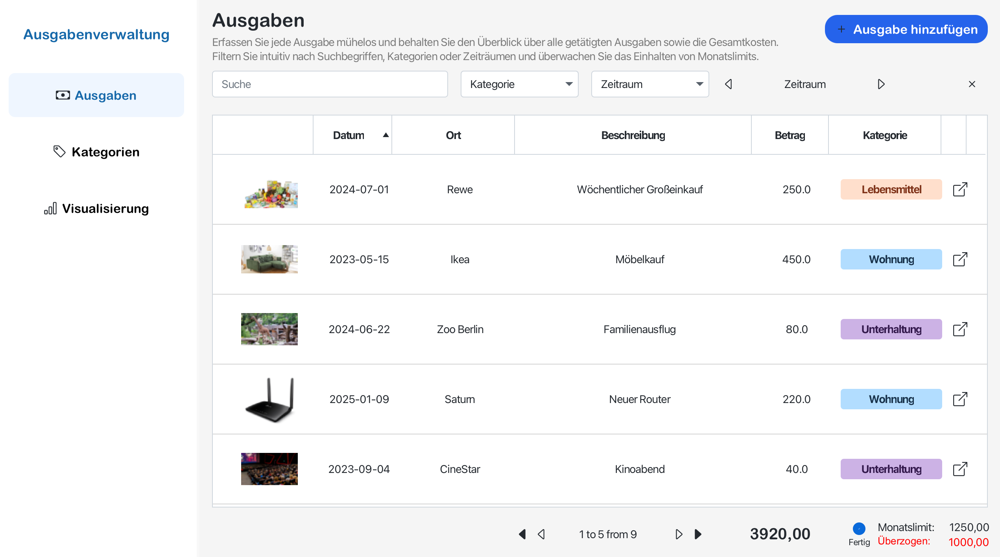
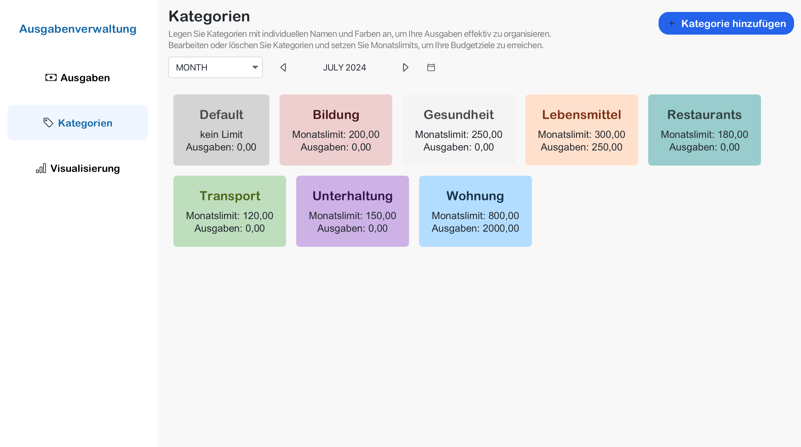
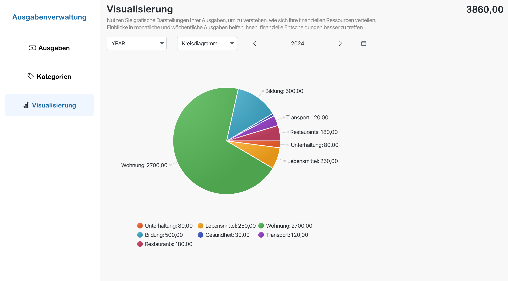

# Ausgabenverwaltung

Ausgabenverwaltung ist eine Softwarelösung, welche Ihnen hilft, Ihre persönlichen Finanzen zu verwalten. 

Die folgende Anwendung ermöglicht es Ihnen, Ausgaben präzise zu erfassen, zu kategorisieren und mittels Diagrammen zu analysieren, während alle Daten gespeichert werden. Sie können ein optionales Bild, Datum, optionale Uhrzeit, Namen des Geschäfts, Betrag und eine Kurzbeschreibung angeben. Dabei werden Sie unterstützt, indem das Datum und die Uhrzeit bereits automatisch eingetragen werden, und sonstige Fehler wie bei der Eingabe des Betrags vermieden werden. Ausgaben werden in einer übersichtlichen Liste angezeigt, in welcher sie anhand des Bildes oder der farblich markierten Kategorie schnell zugeordnet werden können. Sie können Ausgaben nicht nur hinzufügen, sondern mit der bereits bekannten Benutzeroberfläche bearbeiten oder löschen. Um die Übersicht zu behalten, können Sie die Ausgabenliste mittels Suchbegriffen, Kategorien oder Zeiträumen filtern. Darüber hinaus können Sie die Liste seitensweise blättern und erhalten eine Summe der Ausgaben, welche sich an die Filterung anpasst. Kategorien verfügen zusätzlich über ein festgelegtes Monatslimit, über welches Sie fortlaufend informiert werden. Beispielsweise erhalten Sie Benachrichtigungen, wenn Sie eine Ausgabe hinzufügen und somit das festgelegte Limit überschreiten, sowie Informationen darüber, um wie viel das Limit bisher überzogen wurde.

---

